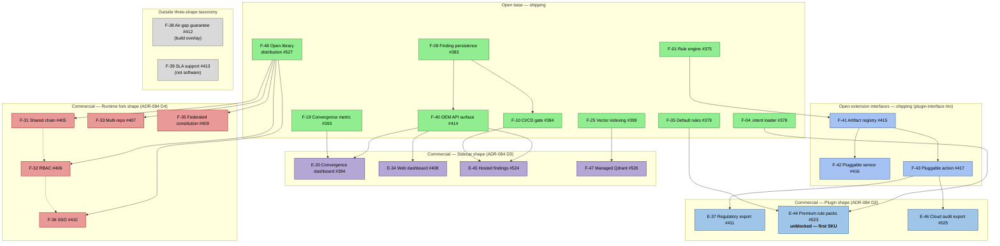

# CORE — Feature Dependency Graph

**Status:** Authoritative (visualization of `CORE-Features.md` + ADR-084 D8)
**Location:** `.specs/planning/CORE-Feature-Dependency-Graph.md`
**Audience:** Internal — sequencing, commercial planning, sprint scoping
**Last updated:** 2026-06-08 (housekeeping reconciliation — F-NN → E-NN class split per ADR-093 D3 applied: six commercial entries with interface-attaching shape renamed (F-20 → E-20, F-34 → E-34, F-37 → E-37, F-44 → E-44, F-45 → E-45, F-46 → E-46); F-31/F-32/F-33/F-35/F-36 stay F-NN per ADR-093 D2 (engine-shape runtime forks); F-38/F-39/F-47 also stay F-NN (build-overlay / not-software / managed-infrastructure carveouts). F-41 + F-42 + F-43 extension-interfaces trio all shipped 2026-06-05/06 — see `CORE-Operational-Completeness.md` §6. All five ADR-085 5+3 feature commitments now closed; no commercial feature has a remaining open-side dependency gate.)

---

## 1. Purpose

This document is the picture-form of the roadmap. The structured data lives in `.specs/papers/CORE-Features.md` (the registry) and in GitHub Project #6 ("CORE Roadmap", queryable by Tier / Scope / Shape / Status). What this file adds is the *shape* — which open prerequisites unblock which commercial features, and how the three commercial-surface shapes (ADR-084 D1) cluster.

When the Mermaid graph here disagrees with the registry, the registry wins. This is a derived artifact; the registry is authoritative.

---

## 2. The dependency picture

Edge legend: solid arrow = hard dependency (`blocked by`); dashed arrow = soft dependency (likely sequencing but not architecturally required).

---

## 3. Sequencing implications

The graph makes the open/commercial sequencing constraint structural rather than aspirational. Four observations follow directly from the picture:

**A. All commercial features now have all-shipping open dependencies.** With F-10, F-40, F-48 (all 2026-06-02), F-27 (2026-06-03), and F-41 + F-42 + F-43 (2026-06-05/06) all shipped, no commercial feature has a roadmap-item dependency. E-37 and E-46 — previously blocked on F-43 — are now unblocked. ADR-083 designated E-44 (formerly F-44 pre-ADR-093 D3) as the first-SKU candidate when E-44 was uniquely unblocked; that uniqueness no longer holds, but ADR-083's strategic argument for sequencing the rule-pack SKU first remains. The remaining constraint on commercial work is ADR-085 D1 (capacity gate pending three quality goals #561 / #562 / #563), not dependency structure.

**B. F-40 unblocked four commercial features at once.** Shipping F-40 (2026-06-02) released E-20, E-34, E-45, and F-47 simultaneously to commercial work. ADR-084 D3 codified the elevation from "Embedded tier preparation" (Tiers paper §3.5 pre-ADR-084) to single-largest commercial unblocker. (E-NN names per ADR-093 D3 class-split, 2026-06-06; F-47 stays F-NN per ADR-093 D2 as managed-infrastructure carveout.)

**C. F-43 ships (2026-06-06) — E-37 and E-46 unblocked.** Plus the plugin shape becomes available to third-party authors at the same moment, which is the F-41/F-42/F-43 trio's stated purpose. With the trio shipped, no open-side dependency gate remains for any commercial feature; the open/commercial sequencing constraint is now purely an ADR-085 D1 capacity gate, not a dependency one.

**D. F-48 shipped (2026-06-02) — runtime-fork cluster no longer gated.** Open library distribution (PyPI + Docker registry, issue #527) was the shared open-infrastructure prerequisite for all five runtime-fork commercial features (F-31, F-32, F-33, F-35, F-36); that gate is now lifted. *Previously this was a planning gap (the graph had to invent a "PYPI" pseudo-node); ADR-084 §Consequences flagged it for filing.*

---

## 4. Per-feature dependency table

The structured version of the graph. Use this for filtering and for generating the GitHub Project #6 `Blocked by` field.

Track is sourcing (open vs commercial), not ship-state — current ship-state lives in `CORE-Operational-Completeness.md` §1 and on GitHub Project #6 per §5.

| F-ID | Issue | Shape | Track | Hard `blocked by` | Notes |
|---|---|---|---|---|---|
| F-10 | #384 | engine | open | none | top-of-funnel, ships independently |
| E-20 | #394 | sidecar | commercial | F-40, F-19 (F-19 ships) | dashboard rendering the convergence metric (renamed from F-20 per ADR-093 D3) |
| F-31 | #405 | runtime fork | commercial | F-48 | multi-user state model |
| F-32 | #406 | runtime fork | commercial | F-48; soft on F-31 | authority model change |
| F-33 | #407 | runtime fork | commercial | F-48 | daemon architecture change |
| E-34 | #408 | sidecar | commercial | F-40 | full web governance UI (renamed from F-34 per ADR-093 D3) |
| F-35 | #409 | runtime fork | commercial | F-48 | constitution loader change |
| F-36 | #410 | runtime fork | commercial | F-48; soft on F-32 | identity model change |
| E-37 | #411 | plugin | commercial | F-43 | regulatory export atomic action (renamed from F-37 per ADR-093 D3) |
| F-38 | #412 | build overlay | commercial (outside taxonomy) | signed image infra | not really a "feature" |
| F-39 | #413 | not software | commercial (outside taxonomy) | n/a | support contract |
| F-40 | #414 | sidecar-interface | open | F-09 (ships) | OEM API surface — unblocks 4 commercial sidecars |
| F-41 | #415 | plugin-interface | open | F-01 (ships) | artifact type registry |
| F-42 | #416 | plugin-interface | open | F-41 | pluggable sensor model |
| F-43 | #417 | plugin-interface | open | F-41 | pluggable action model |
| E-44 | #523 | plugin | commercial | none (F-04, F-05 ship) | **unblocked — first-SKU candidate** (renamed from F-44 per ADR-093 D3) |
| E-45 | #524 | sidecar | commercial | F-40, F-10 | Audit-tier polish surface (renamed from F-45 per ADR-093 D3) |
| E-46 | #525 | plugin | commercial | F-43 | non-regulated audit export (renamed from F-46 per ADR-093 D3) |
| F-47 | #526 | sidecar | commercial | none materially (F-25 ships) | managed infrastructure, not application code |
| F-48 | #527 | engine | open | none | unblocks all 5 runtime-fork commercial features |

---

## 5. What this document is NOT

- **Not a project tracker.** Status, priority, and assignee live on the GitHub issues and Project #6. This document carries the dependency *structure*, which changes slowly (shape buckets are constitutional per ADR-084 D7) and benefits from being plain text in the repo.
- **Not the canonical feature definition.** Each F-ID's authoritative definition lives in `papers/CORE-Features.md` §3. The notes here are abbreviations.
- **Not commercial strategy.** The commercial sequencing (which SKU ships first, pricing, GTM) lives in `commercial/CORE-Products.md` and is private. This file contains the *dependency facts*, not the commercial decisions.

When a new commercial feature is stamped (per the ADR-083 pattern), update this graph in the same change-set so the picture stays current. ADR-084 D6 (interface symmetry) means every new commercial feature has a well-defined `blocked by` open prerequisite — the new edge is always derivable from the stamping ADR.

---

## 6. References

- `papers/CORE-Features.md` §3 (feature definitions) and §4.1 (shape buckets per ADR-084 D8)
- `papers/CORE-Product-Tiers.md` §3 (tier-to-feature mapping) and §3.5 (F-40's elevated structural role)
- ADR-083 — stamps F-44–F-47 (entries referenced under their original F-NN names per ADR-093 D6 append-only discipline; current canonical names are E-44 / E-45 / E-46 / F-47 per ADR-093 D3)
- ADR-084 — three-shape taxonomy + open-core honesty contract
- ADR-093 — F-NN / E-NN class split + URS-line discipline (D2 retains F-NN for engine-shape and not-software entries; D3 migrates six interface-attaching commercial entries to E-NN; D6 preserves prior ADR references under original names)
- GitHub Project #6 "CORE Roadmap" — queryable surface (Tier, Scope, Shape, Status custom fields)
- `planning/archive/CORE-GitHub-Project-Management.md` — operational governance of the Project board
- `planning/archive/CORE-A3-plan.md` — band-level milestone planning
