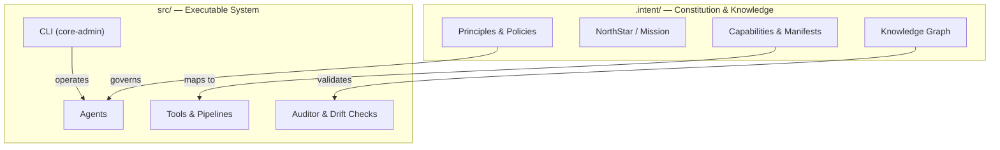

# CORE — The Self-Improving System Architect

> **Where Intelligence Lives.**

[](https://github.com/DariuszNewecki/CORE/releases)

[](LICENSE)

## 🟢 Project Status: **MVP v0.2.0** (released 2025-08-15)

CORE has reached MVP: it can autonomously scaffold a governed application from a high-level goal and verify it against a constitution. The governance loop, drift checks, and nightly audit are active.

* **Releases:** [https://github.com/DariuszNewecki/CORE/releases](https://github.com/DariuszNewecki/CORE/releases)
* Nightly audit validates the constitutional bundle and checks capability drift.
* CI runs formatting, linting, tests, and self-audit.

---

## What is CORE?

CORE is a self-governing, constitution‑aligned AI development framework. It plans, writes, validates, and evolves software systems—autonomously, with traceability and guardrails.

### Mind/Body model



## Quickstart (90 seconds)

Requires Python **3.11+** (3.12 supported), Linux/macOS. Uses **Poetry**.

```bash
# 1) Clone & install
git clone https://github.com/DariuszNewecki/CORE.git
cd CORE
poetry install

# 2) Sanity checks (format, lint, tests, self-audit)
poetry run black --check .
poetry run ruff check .
poetry run pytest -q

# 3) Generate a governed starter (example)
poetry run core-admin new --name my_governed_app --kit default

# 4) Optional: scaffold an agent from intent
poetry run core-admin agent scaffold --name PlannerAgent

# 5) Run constitutional audit locally (verbose)
poetry run core-admin audit --verbose
```

If you prefer **pip**, you can export dependencies:

```bash
poetry export -f requirements.txt --output requirements.txt --without-hashes
pip install -r requirements.txt
```

## Key Capabilities (MVP scope)

* Autonomous scaffold from intent (`core-admin new`).
* Constitutional audit (rules in `.intent/`; nightly CI job).
* Capability drift detection (maps `# CAPABILITY:` tags ↔ manifests).
* Validation pipeline for code and YAML.

## CI / CD

* **Format & Lint:** Black, Ruff
* **Tests:** pytest (coverage gating planned)
* **Security:** CodeQL
* **Governance:** Nightly Constitutional Audit & Drift Check

See `.github/workflows/` for details.

## Roadmap

* **v0.3:** stronger examples, richer starter kits, coverage gating
* **v0.4:** policy-as-code expansions, contributor UX polish
* **v0.5:** advanced introspection & auto-refactor loops

Track progress in Projects and Issues.

## Contributing

We welcome focused, high-quality contributions:

* Read **CONTRIBUTING.md**
* Use conventional commits (`feat:`, `fix:`, `chore:` …)
* Open an issue before major changes
* Run the checks above before pushing

## Security

Please report vulnerabilities **privately**. See **SECURITY.md** for the disclosure process and response targets.

## License

MIT — see **LICENSE**.
