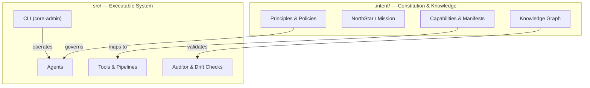

# CORE — The Self-Improving System Architect

<!-- Governance Status -->

[](https://github.com/DariuszNewecki/CORE/actions/workflows/guard-and-drift.yml)

> **Where Intelligence Lives.**

[](https://github.com/DariuszNewecki/CORE/releases)

[](LICENSE)

---

## 🟢 Project Status: **MVP v0.2.0** (released 2025-08-15)

CORE can **enforce a constitution-backed workflow**: validate domain manifests, check domain boundaries via an AST-based guard, surface drift evidence, and run these checks in CI.

* **Releases:** [https://github.com/DariuszNewecki/CORE/releases](https://github.com/DariuszNewecki/CORE/releases)
* CI runs governance checks (guard & drift) plus lint and tests on every push/PR.

---

## Governance Status

This project is governed by the **constitution** in `.intent/`. Every push/PR runs:

* **Manifest migration & validation** (schema + duplicate capability check)
* **Intent Guard** (domain boundary & library policy)
* **Fast checks** (lint + tests)

### Quick commands

```bash
# Create missing manifests, validate, and check duplicates
make migrate

# Generate drift evidence and view summary
make drift            # writes reports/drift_report.json

# Enforce import boundaries
make guard-check
```

### 🎥 90-second demo

The GIF shows a typical loop: `make migrate` → `make drift` → `core-admin guard check`.

---

## What is CORE?

CORE is a self-governing, constitution-aligned AI development framework. It plans, validates, and evolves software with traceability and guardrails.

### Mind/Body model



---

## Quickstart (≈90 seconds)

Requires **Python 3.9+** (3.11 recommended), Linux/macOS. Uses **Poetry**.

```bash
# 1) Clone & install
git clone https://github.com/DariuszNewecki/CORE.git
cd CORE
poetry install

# 2) Sanity checks (format, lint, tests)
poetry run black --check .
poetry run ruff check .
poetry run pytest -q

# 3) Governance: scaffold/validate manifests and check boundaries
make migrate
make drift
poetry run core-admin guard check
```

If you prefer **pip**, you can export dependencies:

```bash
poetry export -f requirements.txt --output requirements.txt --without-hashes
pip install -r requirements.txt
```

---

## Key Capabilities (MVP scope)

* Constitution-first governance (`.intent/` is the source of truth)
* Manifest validation (JSON Schema) and duplicate capability detection
* AST-based import guard enforcing domain boundaries and library policy
* Drift evidence generation to `reports/drift_report.json` and CLI surfacing
* CI enforcement via GitHub Actions (Guard & Drift workflow)

---

## CI / CD

* **Governance:** Guard & Drift workflow on push/PR (`.github/workflows/guard-and-drift.yml`)
* **Format & Lint:** Black, Ruff
* **Tests:** pytest

See `.github/workflows/` for details.

---

## Roadmap

* **v0.3:** richer starter kits, extended guard rules, coverage gating
* **v0.4:** policy-as-code expansions, contributor UX polish
* **v0.5:** deeper introspection & automated refactor loops

Track progress in **Projects** and **Issues**.

---

## Contributing

We welcome focused, high-quality contributions:

* Read `CONTRIBUTING.md`
* Use conventional commits (`feat:`, `fix:`, `chore:`, …)
* Open an issue before major changes
* Run the checks above before pushing

---

## Security

Please report vulnerabilities privately. See `SECURITY.md` for the disclosure process.

---

## License

MIT — see `LICENSE`.
