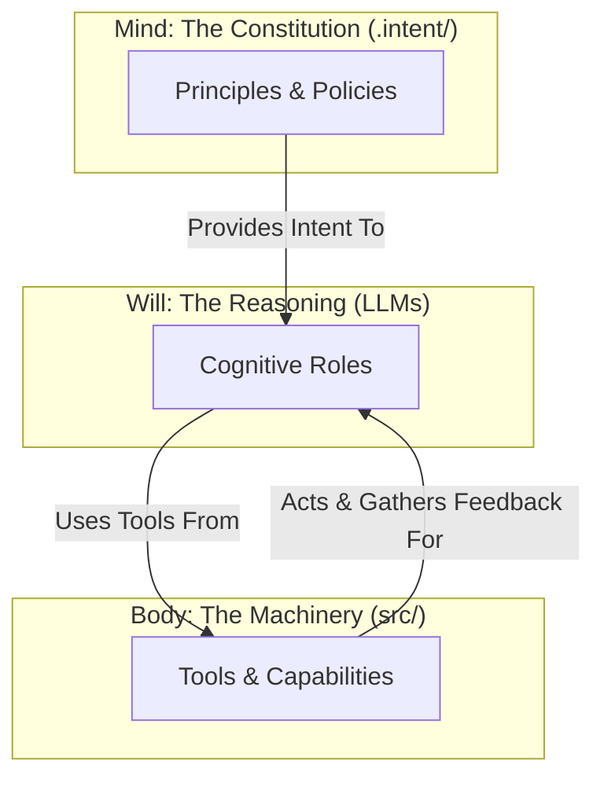

# CORE — The Self-Improving System Architect

> **Where Intelligence Lives.**

[](https://github.com/DariuszNewecki/CORE/releases)

[](LICENSE)

## 🟢 Project Status: **MVP v0.2.0** (released 2025-08-15)

CORE has reached its first major milestone: it can autonomously scaffold a new, governed software application from a high-level goal and continuously verify its architectural integrity against a formal constitution.

* **Stable Release:** The `v0.2.0` release is available on the `release/v0.2.0` branch. This is the recommended starting point for new users.
* **Active Development:** The `main` branch is now focused on a major architectural evolution to the **Mind/Body/Will** model.

---

## 🎥 90‑second demo

[](docs/assets/core-90s-demo.gif)

> The GIF shows: `core-admin new` → `guard drift` on a fresh repo.

---

## What is CORE?

CORE is a self-governing, constitution‑aligned AI development framework. It plans, writes, validates, and evolves software systems—autonomously, with traceability and guardrails.

### The Architectural Trinity: Mind, Body, and Will

CORE is built on a foundational trinity that separates purpose, action, and reasoning:

* 🏛️ **The Mind (`.intent/`):** The declarative constitution. It holds the principles, policies, and knowledge of what the system *is* and *should be*. It is the source of truth.
* 🦾 **The Body (`src/`):** The executable machinery. A set of simple, reliable tools (file writers, test runners, linters) that act upon the world.
* 🧠 **The Will (LLMs):** The reasoning layer. An orchestrated set of specialized AI agents that interpret the Mind's intent and wield the Body's tools to achieve goals.



---

## Quickstart (90 seconds)

> Requires **Python 3.11+** and **Poetry**.

```bash
# 1) Clone the repository and check out the stable release
git clone https://github.com/DariuszNewecki/CORE.git
cd CORE
git checkout release/v0.2.0

# 2) Install dependencies
poetry install

# 3) Run all checks (format, lint, tests, self-audit)
make check

# 4) Generate a governed starter application
poetry run core-admin new my_governed_app
```

---

## Key Capabilities (v0.2.0 MVP)

* Autonomous scaffolding from high-level intent (`core-admin new`).
* Constitutional self-audit against rules in `.intent/`.
* Capability drift detection (maps `# CAPABILITY:` tags in code to manifests).
* CI/CD pipeline for formatting, linting, testing, and nightly governance checks.

---

## Roadmap

The historical roadmap leading to v0.2.0 is now complete. Our future work is focused on a single epic: evolving CORE into a true reasoning system.

* **v1.0 — The Reasoning System:** Refactor the system to use a policy-driven, role-based cognitive layer (the "Will"), making its intelligence governable by the constitution.

Track progress in the **v1.0 Milestone** and the full **Project Roadmap**.

---

## Contributing

We welcome focused, high-quality contributions to our next evolution on the `main` branch.

* Read **[CONTRIBUTING.md](CONTRIBUTING.md)**.
* Review our **[Roadmap](docs/04_ROADMAP.md)**.
* Use **Conventional Commits** (`feat:`, `fix:`, `chore:`, …).

---

## Security

Please report vulnerabilities privately. See **[SECURITY.md](SECURITY.md)** for the disclosure process.

---

## License

MIT — see **[LICENSE](LICENSE)**.
