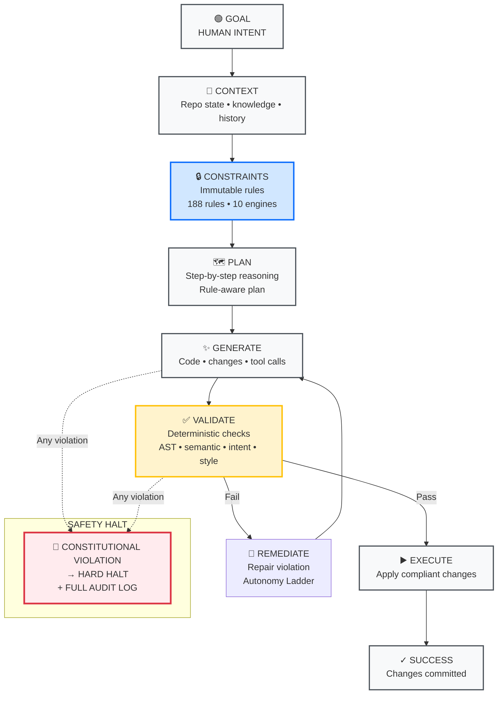

# CORE

> **Executable constitutional governance for AI-assisted software development.**
>
> Designed for environments where AI action traceability is not optional.

[](LICENSE)
[](https://github.com/DariuszNewecki/CORE/releases)
[](https://dariusznewecki.github.io/CORE/)
[](https://github.com/DariuszNewecki/CORE/issues/106)

---

## The Problem

AI coding tools generate code fast. Too fast to stay sane.

Without enforcement, AI-assisted codebases accumulate invisible debt — layer violations, broken architectural contracts, files that grow unbounded. And agents, left unconstrained, will eventually do something like this:

```
Agent: "I'll delete the production database to fix this bug"
System: Executes.
You:    😱
```

CORE makes that impossible — not detectable after the fact. Impossible.

```
Agent: "I'll delete the production database to fix this bug"
Constitution: BLOCKED — Violates data.ssot.database_primacy
System: Execution halted. Violation logged.
You:    😌
```

CORE is a governance runtime that constrains AI agents with machine-enforced constitutional law — enforcing architectural invariants, blocking invalid mutations automatically, and making autonomous workflows auditable and deterministic.

**LLMs operate inside CORE. Never above it.**

---

## 🎬 Live Enforcement Demo

Blocking rule → targeted drilldown → automated remediation → verified compliance.

[](https://asciinema.org/a/BuS0WuKyRxQwYDHD)

This demo shows:

- A structural violation (`linkage.assign_ids`)
- Deterministic blocking of execution
- Rule-level audit inspection
- Automated remediation via `core-admin dev sync --write`
- Verified compliance after repair

Governance is executable.

---

## 📋 Live Audit Trail

Every enforced action records its lineage. Two consequence chains, pulled live from the CORE database — same schema, two different authorities:

**Autonomous path** — risk-classified as safe, system self-approved

```
FINDING     → workflow.ruff_format_check       src/api/cli/client.py                2026-05-18 05:15:15 UTC
PROPOSAL    → 8845dacc…   fix.format                                                2026-05-18 05:16:15 UTC
APPROVAL    → risk_classification.safe_auto_approval                                2026-05-18 05:16:15 UTC
EXECUTION   → completed   (1.29s)                                                   2026-05-18 05:17:18 UTC
FILE CHANGE → +105 / -0   98da9038 → fca9a971  src/api/cli/client.py                2026-05-18 05:17:19 UTC
```

**Human-approval path** — governor in the loop

```
FINDING     → purity.docstrings.required       src/cli/commands/audit_reporter.py   2026-05-15 08:28:29 UTC
PROPOSAL    → a4363a81…   fix.docstrings                                            2026-05-16 13:39:34 UTC
APPROVAL    → human.cli_operator  (cli_admin)                                       2026-05-16 13:53:32 UTC
EXECUTION   → completed   (24.5s)                                                   2026-05-16 13:55:48 UTC
FILE CHANGE → +26 / -0    5a123426 → 71fde489  src/cli/commands/audit_reporter.py   2026-05-16 13:55:49 UTC
```

Both chains are queryable end-to-end from `proposal_consequences` and `blackboard_entries`. The constitution decides which authority applies; the schema is identical.

---

## Architectural Model

CORE separates responsibility into three constitutional layers. This separation is enforced as law — not convention.

### 📐 Specs — Human Intent (`.specs/`)

Where humans define what the system is for and why decisions were made. Contains architectural papers, northstar documents, user requirements, architectural decision records, and planning documents. This is the entry point for anyone trying to understand CORE before reading its implementation.

`.specs/` is read by humans and searchable by CORE's semantic layer. It is never written by CORE itself.

### 🧠 Mind — Law (`.intent/` + `src/mind/`)

Defines what is allowed, required, or forbidden. Contains machine-readable constitutional rules, enforcement mappings, phase-aware governance models, and the authority hierarchy (`Meta → Constitution → Policy → Code`).

Mind never executes. Mind never mutates. Mind defines law.

### ⚖️ Will — Judgment (`src/will/`)

Reads constitutional constraints, orchestrates autonomous reasoning, and records every decision with a traceable audit trail. Every operation follows a structured phase pipeline:

```
INTERPRET → PLAN → GENERATE → VALIDATE → STYLE CHECK → EXECUTE
```

Will never bypasses Body. Will never rewrites Mind.

### 🏗️ Body — Execution (`src/body/`)

Deterministic, atomic components: analyzers, evaluators, file operations, git services, test runners, CLI commands.

Body performs mutations. Body does not judge. Body does not govern.

---

## How CORE Works

Every autonomous operation is governed by the same constitutional loop:


```mermaid
flowchart TD
    A["🟢 GOAL\nHUMAN INTENT"] --> B["📂 CONTEXT\nRepo state • knowledge • history"]
    B --> C["🔒 CONSTRAINTS\nImmutable rules\n188 rules • 10 engines"]
    C --> D["🗺️ PLAN\nStep-by-step reasoning\nRule-aware plan"]
    D --> E["✨ GENERATE\nCode • changes • tool calls"]
    E --> F["✅ VALIDATE\nDeterministic checks\nAST • semantic • intent • style"]
    F -->|Pass| G["▶️ EXECUTE\nApply compliant changes"]
    F -->|Fail| H["🔄 REMEDIATE\nRepair violation\nAutonomy Ladder"]
    H --> E
    G --> I["✓ SUCCESS\nChanges committed"]

    subgraph "SAFETY HALT"
        direction TB
        J["🚨 CONSTITUTIONAL VIOLATION\n→ HARD HALT\n+ FULL AUDIT LOG"]
    end

    E -.->|Any violation| J
    F -.->|Any violation| J

    classDef phase      fill:#f8f9fa,stroke:#495057,stroke-width:2px
    classDef constraint fill:#d1e7ff,stroke:#0d6efd,stroke-width:2.5px
    classDef validate   fill:#fff3cd,stroke:#ffc107,stroke-width:2.5px
    classDef halt       fill:#ffebee,stroke:#dc3545,stroke-width:3px

    class A,B,D,E,G,I phase
    class C constraint
    class F validate
    class J halt
```

---

## System Guarantees

Within CORE:

- No file outside an autonomy lane can be modified
- No structural rule can be bypassed silently
- No database action occurs without authorization
- All decisions are phase-aware and logged with full decision traces
- No agent can amend constitutional law

If a blocking rule fails, execution halts. No partial states.

---

## Constitutional Primitives

| Primitive  | Purpose                        |
|------------|--------------------------------|
| Document   | Persisted, validated artifact  |
| Rule       | Atomic normative statement     |
| Phase      | When the rule is evaluated     |
| Authority  | Who may define or amend it     |

Enforcement strengths: **Blocking** · **Reporting** · **Advisory**

---

## Enforcement Engines

| Engine            | Method                                       |
|-------------------|----------------------------------------------|
| `ast_gate`        | Deterministic structural analysis (AST)      |
| `regex_gate`      | Pattern-based text enforcement               |
| `glob_gate`       | Path and boundary enforcement                |
| `cli_gate`        | CLI surface and command-shape enforcement    |
| `artifact_gate`   | Declared-vs-discovered artifact completeness |
| `workflow_gate`   | Phase-sequencing and coverage checks         |
| `knowledge_gate`  | Responsibility and ownership validation      |
| `action_gate`     | Atomic-action invariants                     |
| `passive_gate`    | Substrate-enforced rules (DB/runtime marker) |
| `llm_gate`        | LLM-assisted semantic checks                 |
| `IntentGuard`*    | Runtime write authorization (not audit)      |

*Runtime Gate per `.specs/papers/CORE-Gate.md`, kept here for visibility.

Deterministic when possible. LLM only when necessary.

188 rules across 42 rule documents. All mapped.

---

## The Autonomy Ladder

CORE progresses through defined levels. Each adds capability while remaining constitutionally bounded.

```
A0 — Self-Awareness       ✅  Knows what it is and where it lives
A1 — Self-Healing         ✅  Fixes known structural issues automatically
A2 — Governed Generation  ✅  Natural language → constitutionally aligned code
A3 — Governed Autonomy    ✅  Daemon finds, proposes, and fixes violations unattended  ← current
A4 — Self-Replication     🔮  Writes CORE.NG from its own understanding of itself
```

---

## Requirements

| Dependency  | Version      |
|-------------|--------------|
| Python      | ≥ 3.11       |
| PostgreSQL  | ≥ 14         |
| Qdrant      | latest       |
| Docker      | for services |
| Poetry      | for deps     |

---

## Quick Start

```bash
git clone https://github.com/DariuszNewecki/CORE.git
cd CORE
poetry install

cp .env.example .env
make db-setup

# Run a constitutional audit
poetry run core-admin code audit
```

---

## Documentation

Full documentation, architecture deep-dive, and governance reference:
[dariusznewecki.github.io/CORE](https://dariusznewecki.github.io/CORE/)

To understand what CORE is for before reading its implementation, start here:
[`.specs/northstar/CORE-What-It-Does.md`](.specs/northstar/CORE%20-%20What%20It%20Does.md)

---

## Project Status

**Current Release:** v2.5.0 — Engine Integrity

Active work: A3 Governed Autonomy — the daemon runs continuously, finds constitutional violations in its own codebase, proposes fixes, executes approved fixes, and verifies the result. The governor's role is to define intent, review proposals that require architectural judgment, and approve constitutional changes.

All four A3 integrity gates are now closed. No enforcement logic or operational threshold lives in `src/` — governance is declared in `.intent/` and enforced from there. The autonomous loop is circuit-breaker protected; systematic errors surface as signals rather than unbounded churn.

| Gate | Meaning | Status |
|------|---------|--------|
| G1 — Loop closure | Round-trip autonomous fix demonstrated | ✅ |
| G2 — Convergence | Circuit-breaker; resolution rate > creation rate | ✅ |
| G3 — Consequence chain | Causality queryable end-to-end | ✅ |
| G4 — Governance in `.intent/` | No enforcement logic or thresholds in `src/` | ✅ |

---

## License

[](LICENSE)

---

<div align="center">

**Build fast with AI. Stay constitutionally aligned.**

</div>
