# CORE

> **Constitutional infrastructure for AI-assisted software development.**

## Executive Summary

CORE is a governance runtime that constrains AI agents with machine-enforced constitutional law.

It separates **law (Mind)**, **judgment (Will)**, and **execution (Body)**.
It blocks unsafe or structurally invalid changes automatically.
It enforces architectural invariants continuously.
It makes autonomous workflows auditable, deterministic, and safe by design.

LLMs are tools inside CORE — never authorities.

---

[](#-project-status)
[](#-constitutional-governance)
[](https://dariusznewecki.github.io/CORE/)
[](LICENSE)
[](https://codecov.io/gh/DariuszNewecki/CORE)

---

**CORE is not a coding agent.** CORE is the governance runtime and workflow orchestrator that constrains coding agents — LLMs, tools, and scripts — with executable constitutional rules.

AI-assisted development without structural enforcement inevitably drifts.
CORE enforces structure from day one.

The Constitution lives in `.intent/`.
It is machine-readable.
It is authoritative.
It cannot be bypassed by agents.

If a rule is violated, execution halts.

---

## 🎬 Constitutional Governance in Action

[](https://asciinema.org/a/S4tXkXUclYeTo6kEH1Z5UyUPE)

What happens in this demo:

* An AI agent generates code
* Constitutional auditors validate the change
* Violations are detected
* Blocking rules prevent unsafe mutation
* Execution halts deterministically

No human intervention required.

---

## 🚨 What CORE Solves

### Structural Drift in AI-Generated Code

Without enforcement:

* Layer violations accumulate
* Architectural contracts degrade
* Duplication spreads
* Files grow unbounded
* Implicit coupling emerges

CORE enforces architectural invariants continuously.

---

### Unsafe Autonomous Operations

Without structural enforcement:

```
Agent: "I'll delete the production database to fix this bug"
System: ✅ Executes command
You: 😱
```

With CORE:

```
Agent: "I'll delete the production database to fix this bug"
Constitution: ❌ BLOCKED — Violates data.ssot.database_primacy
System: Execution halted
You: 😌
```

CORE does not trust agents.
CORE verifies and enforces.

---

## 🏛️ How It Works

CORE separates responsibility into three architectural layers.
This separation is constitutional law — not design preference.

## 🧭 High-Level Architecture

```mermaid
---
config:
  layout: fixed
---
flowchart TB
 subgraph W["WILL: GOVERNANCE & ENFORCEMENT"]
    direction LR
        W1["• Rule Engine<br>• AST-Gate<br>• Decision Log"]
        W2["• AST-Gate<br>• IntentGuard<br>• Decision Log"]
  end
 subgraph M["MIND: REASONING & PLANNING"]
    direction TB
        M1["• Reasoning Orchestration<br>• Context Builder<br>• LLM Routing<br>• Retrieval-Augmented Generation<br>• Vector Memory"]
  end
 subgraph P["LLM PROVIDERS"]
    direction TB
        P1["Claude"]
        P2["DeepSeek"]
  end
 subgraph B["BODY: ATOMIC ACTIONS"]
    direction TB
        B1["• Resource Commands"]
  end
 subgraph I["BASE INFRASTRUCTURE"]
    direction LR
        I1["Postgres"]
        I2["Qdrant<br>(vectors + metadata)"]
  end
 subgraph V["EMBEDDING PROVIDER"]
    direction LR
        V1["NOMIC"]
  end
    A[".intent / CONSTITUTION<br><br>• Policies<br>• Autonomy Lanes<br>• Atomic Action Rules"] -- Governance Control --> W
    W -- Governance Control --> M
    M -- LLM Calls / Routing --> P
    M -- Resource Commands --> B
    M -- Embedding Requests --> V
    B <-- Resource Commands --> I
    V --> I2
```



CORE is governance-first. LLMs are tools, not authorities.

---

### 🧠 Mind — Law (`.intent/` + `src/mind/`)

Defines what is allowed, required, or forbidden.

* Machine-readable constitutional rules
* Phase-aware enforcement model
* Authority hierarchy (Meta → Constitution → Policy → Code)

Mind never executes.
Mind never mutates.
Mind defines law.

---

### ⚡ Will — Judgment (`src/will/`)

Universal workflow model:

```
INTERPRET → ANALYZE → STRATEGIZE → GENERATE → EVALUATE → DECIDE
```

Will:

* Reads constitutional constraints
* Orchestrates reasoning
* Delegates execution
* Records traceable decisions

Will never bypasses Body.
Will never rewrites Mind.

---

### 🏗️ Body — Execution (`src/body/`)

Deterministic components:

* Analyzers
* Evaluators
* Atomic Actions
* Resource Commands

Body performs mutations.
Body does not judge.
Body does not govern.

---

## 🔐 System Guarantees

Within CORE:

* No file outside an autonomy lane can be modified
* No structural rule can be bypassed silently
* No database action occurs without authorization
* All decisions are phase-aware and logged
* No agent can amend constitutional law

If a blocking rule fails, execution halts.

---

## 🔒 Constitutional Primitives

| Primitive     | Purpose                    |
| ------------- | -------------------------- |
| **Document**  | Persisted artifact         |
| **Rule**      | Atomic normative statement |
| **Phase**     | When rule is evaluated     |
| **Authority** | Who decides                |

Enforcement strengths: **Blocking**, **Reporting**, **Advisory**.

---

## ⚙️ Enforcement Engines

| Engine             | Method                              |
| ------------------ | ----------------------------------- |
| **ast_gate**       | Deterministic structural validation |
| **glob_gate**      | Path and boundary enforcement       |
| **intent_gate**    | Runtime authorization               |
| **knowledge_gate** | Responsibility validation           |
| **llm_gate**       | LLM-assisted semantic checks        |

Deterministic when possible. LLM only when necessary.

---

## 📊 Current Capabilities

**Constitutional Enforcement**
60+ active rules across blocking, reporting, and advisory strengths.

**Governed Code Generation (A2)**
Natural language → constitutionally aligned code.

**Self-Healing Compliance (A1)**
Automated structural and formatting correction.

**Universal Workflow (A2+)**
All autonomous operations share the same enforceable phase model.

---

## 🎯 The Autonomy Ladder

```
A0 — Self-Awareness        ✅
A1 — Self-Healing          ✅
A2 — Governed Generation   ✅
A2+ — Universal Workflow   ✅  YOU ARE HERE
A3 — Strategic Refactoring 🎯
A4 — Self-Replication      🔮
```

---

## 🚀 Quick Start

```bash
git clone https://github.com/DariuszNewecki/CORE.git
cd CORE
poetry install

cp .env.example .env
make db-setup

poetry run core-admin check audit
```

---

## 📚 Documentation

[https://dariusznewecki.github.io/CORE/](https://dariusznewecki.github.io/CORE/)

---

## 📊 Project Status

**Current Release:** v2.2.0 — Universal Workflow Pattern

Test coverage: 14% (target: 75%)
Pattern migration: in progress
Legacy code: being retired incrementally

---

## 📄 License

MIT License

---

<div align="center">

**CORE: Build fast with AI. Stay structurally aligned.**

</div>
