# CORE

> **Executable constitutional governance for AI-assisted software development.**

[](LICENSE)
[](https://github.com/DariuszNewecki/CORE/releases)
[](https://dariusznewecki.github.io/CORE/)

---

## The Problem

AI coding tools generate code fast. Too fast to stay sane.

Without enforcement, AI-assisted codebases accumulate invisible debt — layer violations, broken architectural contracts, files that grow unbounded. And agents, left unconstrained, will eventually do something like this:

```
Agent: "I'll delete the production database to fix this bug"
System: Executes.
You:    😱
```

CORE makes that impossible — not detectable after the fact. Impossible.

```
Agent: "I'll delete the production database to fix this bug"
Constitution: BLOCKED — Violates data.ssot.database_primacy
System: Execution halted. Violation logged.
You:    😌
```

CORE is a governance runtime that constrains AI agents with machine-enforced constitutional law — enforcing architectural invariants, blocking invalid mutations automatically, and making autonomous workflows auditable and deterministic.

**LLMs operate inside CORE. Never above it.**

---

## 🎬 Live Enforcement Demo

Blocking rule → targeted drilldown → automated remediation → verified compliance.

[](https://asciinema.org/a/BuS0WuKyRxQwYDHD)

This demo shows:

- A structural violation (`linkage.assign_ids`)
- Deterministic blocking of execution
- Rule-level audit inspection
- Automated remediation via `core-admin dev sync --write`
- Verified compliance after repair

Governance is executable.

---

## Architectural Model

CORE separates responsibility into three constitutional layers. This separation is enforced as law — not convention.

### 🧠 Mind — Law (`.intent/` + `src/mind/`)

Defines what is allowed, required, or forbidden. Contains machine-readable constitutional rules, phase-aware enforcement models, and the authority hierarchy (`Meta → Constitution → Policy → Code`).

Mind never executes. Mind never mutates. Mind defines law.

### ⚖️ Will — Judgment (`src/will/`)

Reads constitutional constraints, orchestrates autonomous reasoning, and records every decision with a traceable audit trail. Every operation follows a structured phase pipeline:

```
INTERPRET → PLAN → GENERATE → VALIDATE → STYLE CHECK → EXECUTE
```

Will never bypasses Body. Will never rewrites Mind.

### 🏗️ Body — Execution (`src/body/`)

Deterministic, atomic components: analyzers, evaluators, file operations, git services, test runners, CLI commands.

Body performs mutations. Body does not judge. Body does not govern.

---

## How CORE Works

Every autonomous operation follows a **workflow** composed of reusable phases, declared in `.intent/workflows/` — not in code.

```mermaid
flowchart TD
    HumanGoal(["👤 Human Goal\n(natural language)"])

    HumanGoal --> Interpret["🔍 Interpret\nInfer workflow type\nfrom goal keywords"]

    Interpret -->|refactor / split / extract| WF_R["📦 refactor_modularity"]
    Interpret -->|test / coverage| WF_C["🧪 coverage_remediation"]
    Interpret -->|implement / add / create| WF_F["✨ full_feature_development"]

    subgraph WF_R_FLOW["Refactor Modularity Workflow"]
        direction TB
        R1["📋 Planning\nAnalyze & propose split"] -->
        R2["⚙️ Code Generation\nGenerate refactored modules"] -->
        R3["🐦 Canary Validation\nRun existing tests"] -->
        R4["✅ Style Check\nruff · black · constitutional"] -->
        R5["💾 Execution\nApply changes + git commit"]
    end

    subgraph WF_C_FLOW["Coverage Remediation Workflow"]
        direction TB
        C1["📋 Planning\nIdentify uncovered symbols"] -->
        C2["🧪 Test Generation\nGenerate tests via AI"] -->
        C3["🏖️ Sandbox Validation\nValidate in isolation"] -->
        C4["💾 Execution\nPromote passing tests"]
    end

    subgraph WF_F_FLOW["Full Feature Development Workflow"]
        direction TB
        F1["📋 Planning\nStructure the task"] -->
        F2["⚙️ Code Generation\nGenerate feature code"] -->
        F3["🧪 Test Generation\nGenerate feature tests"] -->
        F4["🐦 Canary Validation\nRun existing tests"] -->
        F5["🏖️ Sandbox Validation\nValidate new tests"] -->
        F6["✅ Style Check"] -->
        F7["💾 Execution\nApply + commit"]
    end

    WF_R --> WF_R_FLOW
    WF_C --> WF_C_FLOW
    WF_F --> WF_F_FLOW

    WF_R_FLOW --> Constitutional
    WF_C_FLOW --> Constitutional
    WF_F_FLOW --> Constitutional

    Constitutional{"🏛️ Constitutional\nCompliance Check\n92 rules · 7 engines"}

    Constitutional -->|PASS| Commit["✅ Committed to Git\nClean audit trail"]
    Constitutional -->|FAIL| Halt["🛑 Halted\nViolation logged\nNo changes applied"]
```

<details>
<summary>📊 Expand workflow diagram</summary>



</details>

---

## System Guarantees

Within CORE:

- No file outside an autonomy lane can be modified
- No structural rule can be bypassed silently
- No database action occurs without authorization
- All decisions are phase-aware and logged with full decision traces
- No agent can amend constitutional law

If a blocking rule fails, execution halts. No partial states.

---

## Constitutional Primitives

| Primitive  | Purpose                        |
|------------|--------------------------------|
| Document   | Persisted, validated artifact  |
| Rule       | Atomic normative statement     |
| Phase      | When the rule is evaluated     |
| Authority  | Who may define or amend it     |

Enforcement strengths: **Blocking** · **Reporting** · **Advisory**

---

## Enforcement Engines

| Engine           | Method                                        |
|------------------|-----------------------------------------------|
| `ast_gate`       | Deterministic structural analysis (AST-based) |
| `glob_gate`      | Path and boundary enforcement                 |
| `intent_gate`    | Runtime write authorization                   |
| `knowledge_gate` | Responsibility and ownership validation       |
| `workflow_gate`  | Phase-sequencing and coverage checks          |
| `regex_gate`     | Pattern-based text enforcement                |
| `llm_gate`       | LLM-assisted semantic checks                  |

Deterministic when possible. LLM only when necessary.

92 rules across 33 policies. 78 executable. 0 blocking violations.

---

## The Autonomy Ladder

CORE progresses through defined levels. Each adds capability while remaining constitutionally bounded.

```
A0 — Self-Awareness       ✅  Knows what it is and where it lives
A1 — Self-Healing         ✅  Fixes known structural issues automatically
A2 — Governed Generation  ✅  Natural language → constitutionally aligned code  ← current
A3 — Strategic Autonomy   🎯  Autonomously identifies architectural improvements
A4 — Self-Replication     🔮  Writes CORE.NG from its own understanding of itself
```

---

## Requirements

| Dependency  | Version      |
|-------------|--------------|
| Python      | ≥ 3.11       |
| PostgreSQL  | ≥ 14         |
| Qdrant      | latest       |
| Docker      | for services |
| Poetry      | for deps     |

---

## Quick Start

```bash
git clone https://github.com/DariuszNewecki/CORE.git
cd CORE
poetry install

cp .env.example .env
make db-setup

# Run a constitutional audit
poetry run core-admin check audit
```

---

## Documentation

Full documentation, architecture deep-dive, and governance reference:
[dariusznewecki.github.io/CORE](https://dariusznewecki.github.io/CORE/)

---

## Project Status

**Current Release:** v2.2.0 — Constitutional Workflow System

Active work: increasing test coverage autonomously (A2) and stabilising before advancing to A3 strategic autonomy.

---

## License

MIT License

---

<div align="center">

**Build fast with AI. Stay constitutionally aligned.**

</div>
