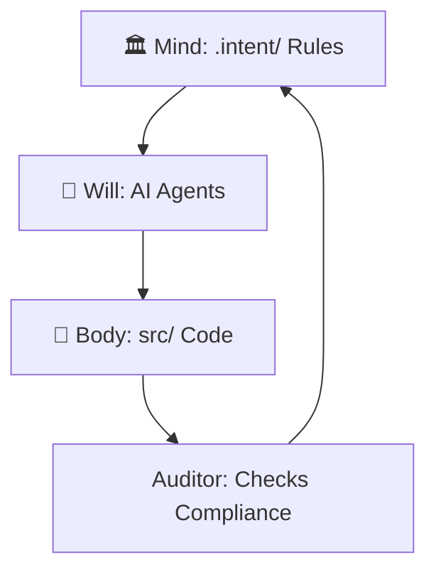
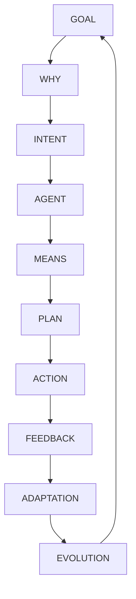

# The CORE Philosophy

---

## For New Users: What Is CORE?

CORE is like a **“smart architect”** for software: it ensures your code follows your project’s rules, preventing chaos even when AI writes code.

Think of it as a **city**:

* 🏛️ **Mind** = the plan.
* 🦾 **Body** = the buildings.
* 🧠 **Will** = the planners who follow the plan.

👉 **Try It:** Run the *Worked Example* to see CORE catch a mistake in 5 minutes.

---

## Prime Directive

CORE transforms **human intent into complete, evolving software systems** — without drift, duplication, or degradation.

It governs, learns, and rewrites itself using a **machine-readable constitution**, ensuring safe and transparent development.

---

## The Architectural Trinity: Mind, Body, and Will

CORE’s design separates concerns for **governance and safety**:

* 🏛️ **Mind (`.intent/`)**: YAML/JSON files defining rules and purpose (*what* and *why*).
* 🦾 **Body (`src/`)**: Simple Python tools for actions (*how*), like writing files.
* 🧠 **Will (AI Layer)**: AI agents (e.g., Planner) that reason within Mind’s rules to use Body’s tools.

### Visual

**Deep Dive for Experts:** The trinity enforces `separation_of_concerns`.
The **ConstitutionalAuditor** validates Body against Mind, preventing ungoverned AI actions.
See `source_structure.yaml` for domain rules.

---

## The Ten-Phase Loop of Reasoned Action

Every action follows this **deliberate cycle**:

1. **GOAL**: Human request (e.g., *“Add cryptographic signing”*).
2. **WHY**: Tie to principle (e.g., `safe_by_default`).
3. **INTENT**: Formal plan (machine-readable).
4. **AGENT**: Pick AI role (e.g., Planner).
5. **MEANS**: Check Body’s tools (e.g., file writing).
6. **PLAN**: Detail steps.
7. **ACTION**: Execute via Body.
8. **FEEDBACK**: Auditor/tests check compliance.
9. **ADAPTATION**: AI fixes errors.
10. **EVOLUTION**: Update Mind’s knowledge.

👉 Simplified: It’s a **“think–plan–do–check”** loop to avoid reckless changes.

### Diagram

---

## Glossary

* **Drift**: Code breaking rules.
* **Constitution**: Rules in `.intent/`.

---

## Troubleshooting

* **Confused by terms?** See **README**.
* **Audit fails?** Run `make check` and check `reports/drift_report.json`.

---

## Takeaways

* CORE ensures **deliberate, safe changes**.
* **Next**: See *Architecture* for technical details.

---

## Contribute

Suggest a new principle in `principles.yaml`! Open an issue.
