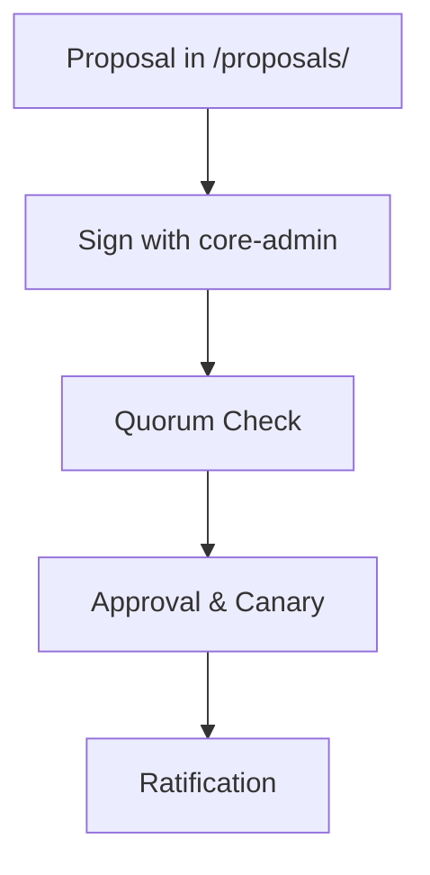

# The CORE Governance Model

---

## For New Users: Safe Changes

CORE evolves like a **government with checks**: you propose changes, sign them, and test them in a *sandbox* (**Canary Check**) to avoid breaking things.

It’s like updating laws safely.

👉 **Try It**: Generate a key with:

```bash
core-admin keygen "your.email@example.com"
```

---

## The Guiding Principle: The Canary Check

Before changing `.intent/`, CORE tests changes **in memory**:

* ✅ **Pass**: Apply to live system.
* ❌ **Fail**: Reject to avoid damage.

**Analogy:** Like testing a new recipe before serving it.

---

## The Life of a Constitutional Amendment

5 steps to update `.intent/`:

### Visual



---

### Step 1: Proposal (`.intent/proposals/`)

Create a YAML file (e.g., `cr-rate-limit.yaml`):

```yaml
target_path: .intent/policies/safety_policies.yaml
justification: Add rate limiting for safety.
content: |
  rate_limiting:
    max_requests: 100
```

---

### Step 2: Signing (`core-admin proposals-sign`)

Prove human intent:

```bash
core-admin keygen "your.email@example.com"  # One-time
core-admin proposals-sign cr-rate-limit.yaml
# Output: Signed cr-rate-limit.yaml with key your.email@example.com
```

---

### Step 3: Quorum Verification

Check `approvers.yaml` for signatures needed:

* **Standard**: 1 signature.
* **Critical**: 2+ signatures.

---

### Step 4: Approval & Canary (`core-admin proposals-approve`)

```bash
core-admin proposals-approve cr-rate-limit.yaml
# Output: Canary passed; change ready to apply
```

---

### Step 5: Ratification

* If passed, updates `.intent/`.
* Logs history.

**Deep Dive:** Uses **cryptographic signatures**; quorum from `approvers.yaml`.

---

## Troubleshooting

* **Key error?** Regenerate with `core-admin keygen`.
* **Audit fails?** Check `reports/` logs.

---

## Takeaways

* Safe, **auditable evolution**.
* **Next**: Roadmap for future plans.

---

## Contribute

Propose a **new policy**! See `CONTRIBUTING.md`.
