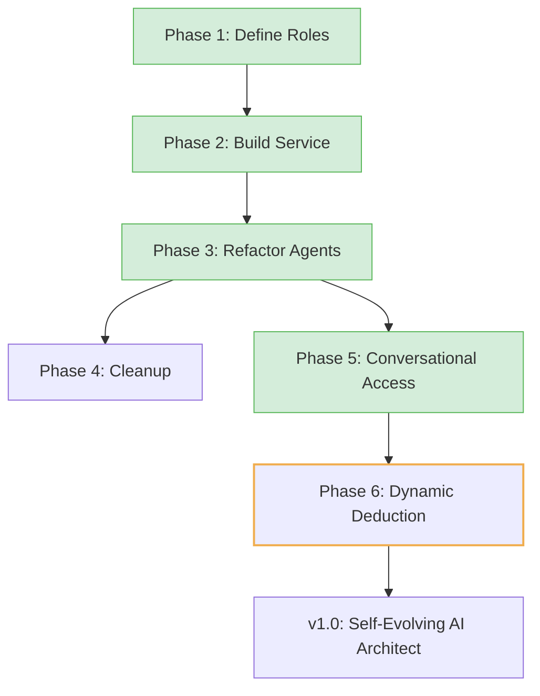

# The CORE Project Roadmap

## For New Users: Where CORE Is Going

CORE is evolving from a system that audits code (**A0**) into a conversational AI architect (**A4**) that builds apps from your ideas.
The foundational governance and the new conversational layer are now complete.
Each phase moves us toward accessible, self-evolving software development, governed by strict rules.

👉 **You can help!** Check out the **Next Up** phase in the table below for great contribution opportunities.

---

## Preamble: From Foundation to Self-Evolution

* The project has a stable foundation for audits and governance.
* The core logic for the policy-driven AI layer (**Mind/Body/Will**) is implemented.
* With the completion of the conversational chat command, the system can now translate natural language into structured goals.
* Next steps focus on making the system's reasoning more dynamic and optimized.

📄 **Historical work:** [`docs/archive/StrategicPlan.md`](docs/archive/StrategicPlan.md)

---

## GitHub Epic: Policy-Driven Cognitive Layer

### The v1.0 Epic: Mind/Body/Will Trinity

**Goal:** Build a self-evolving system that understands non-coders’ ideas and optimizes AI usage without hardcoded limits.

---

## Roadmap Phases

| Phase                    | Challenge                    | Goal                                                           | Status      | Opportunity                                                          | ETA               |
| ------------------------ | ---------------------------- | -------------------------------------------------------------- | ----------- | -------------------------------------------------------------------- | ----------------- |
| 1: Constitution          | Implicit AI roles in code    | Define `cognitive_roles.yaml` for roles like Planner, Coder    | ✅ Completed | Refine roles or propose new specialized agents (e.g., TestWriter).   | Completed Q3 2024 |
| 2: Machinery             | Body has AI logic            | Build simple `CognitiveService` to read roles                  | ✅ Completed | Optimize the CognitiveService for performance or caching.            | Completed Q3 2024 |
| 3: Agents                | Agents use hardcoded clients | Refactor agents to use `CognitiveService`                      | ✅ Completed | Improve the agent reasoning loop in `run_development_cycle`.         | Completed Q3 2024 |
| 4: Cleanup               | Obsolete classes             | Remove old `BaseLLMClient`; update `runtime_requirements.yaml` | ⏳ Planned   | A great first-time contributor task to remove `src/core/clients.py`. | Q4 2024           |
| 5: Conversational Access | CLI limits non-coders        | Add `IntentTranslator` agent and core-admin chat command       | ✅ Completed | Improve the `intent_translator.prompt` for more complex queries.     | Completed Q3 2024 |
| 6: Dynamic Deduction     | Static LLM assignments       | Add `DeductionAgent` + policy to optimize LLM choices          | ▶️ Next Up  | Propose `deduction_policy.yaml`; design and code the scoring logic.  | Q1 2025           |

---

## Visual (Mermaid)

---

## Future Phases (Post-v1.0)

| Phase              | Goal                                                   | ETA     |
| ------------------ | ------------------------------------------------------ | ------- |
| Web Interface & DB | Evolve CLI to web UI with DB backing for accessibility | Q2 2025 |

---

## Historical Roadmap (v0.2.0, Completed)

* ✅ Scaling Constitution
* ✅ Autonomous MVP
* ✅ Self-Improvement
* ✅ Robustness
* ✅ Architectural Health

---

## Takeaways

* **Phase 5 is complete!** The system now accepts natural language commands.
* The next major feature is **Phase 6**, which will make the system's AI usage *smarter*.
* The project is on track for a **v1.0 release in Q1 2025**.

---

## Contribute

* The immediate focus is **Phase 6: Dynamic Deduction** — a fantastic challenge for AI and systems engineers.
* For beginners, **Phase 4: Cleanup** is a perfect, well-defined first issue to tackle.
  ✅ Check GitHub issues to get started!
