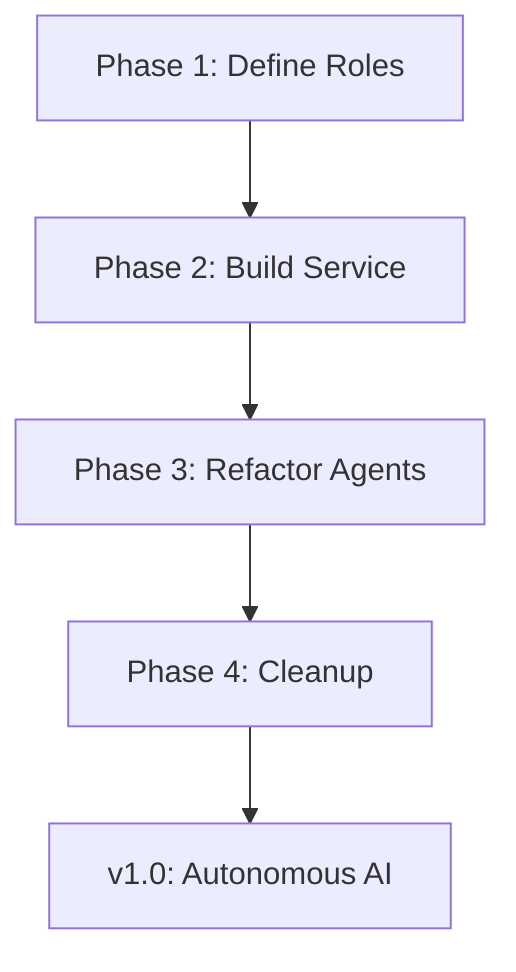

# The CORE Project Roadmap

---

## For New Users: Where CORE Is Going

CORE’s roadmap takes it from a **prototype that watches code (A0)** to **building apps autonomously (A4)**. Each phase is a step toward **AI-driven development**.

👉 **You can help!**

**Try It:** Check open issues to join a phase.

---

## Preamble: From Foundation to Reason

* **v0.2.0** built a stable base (audits, governance).
* Now, CORE aims for a **policy-driven AI layer (Mind/Body/Will)**.
* Historical work is in `StrategicPlan.md`.

---

## GitHub Epic: Policy-Driven Cognitive Layer

### The v1.0 Epic: Mind/Body/Will Trinity

**Goal:** Replace hardcoded AI logic with **role-based system**.

| Phase               | Challenge                 | Goal                          | Status        | Opportunity                           | ETA     |
| ------------------- | ------------------------- | ----------------------------- | ------------- | ------------------------------------- | ------- |
| **1: Constitution** | Implicit AI roles in code | Define `cognitive_roles.yaml` | ⏳ Not Started | Propose roles (e.g., SecurityAnalyst) | Q4 2025 |
| **2: Machinery**    | Body has AI logic         | Simple CognitiveService       | ⏳ Not Started | Code client config                    | Q4 2025 |
| **3: Agents**       | Agents use clients        | Refactor to CognitiveService  | ⏳ Not Started | Update `run_development_cycle`        | Q1 2026 |
| **4: Cleanup**      | Obsolete classes          | Remove old clients            | ⏳ Not Started | Update `runtime_requirements.yaml`    | Q1 2026 |

### Visual

---

## Historical Roadmap (v0.2.0, Completed)

* ✅ Scaling Constitution
* ✅ Autonomous MVP
* ✅ Self-Improvement
* ✅ Robustness
* ✅ Architectural Health

---

## Troubleshooting

**Want to contribute?** Open an issue for a phase task.

---

## Takeaways

* **v1.0 targets Q1 2026** with community help.
* **Next**: See `CONTRIBUTING.md` to join.

---

## Contribute

Pick a **phase** (e.g., Phase 2) and PR!
See GitHub issues.
