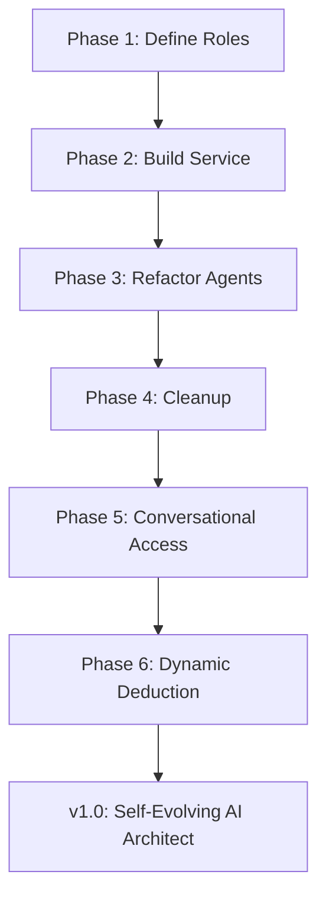

# The CORE Project Roadmap

## For New Users: Where CORE Is Going

CORE is evolving from a prototype that **watches code (A0)** to a **conversational AI architect (A4)** that builds apps from your ideas—no coding needed.
Each phase moves us toward accessible, self-evolving software development, governed by strict rules.

👉 **You can help!** Try a beginner task like adding a docstring, or join a phase on GitHub.
**Try It:** Check open issues to contribute to a phase.

---

## Preamble: From Foundation to Self-Evolution

CORE **v0.2.0** established a stable foundation: audits, governance, and a constitution (`.intent/`).
Now, we aim for a **policy-driven, conversational AI layer (Mind/Body/Will)** that translates informal ideas ("gibberish") into professional apps—deducing the best tools dynamically while staying governed.

📄 Historical work: `StrategicPlan.md`

---

## GitHub Epic: Policy-Driven Cognitive Layer

### The v1.0 Epic: Mind/Body/Will Trinity

**Goal:** Build a self-evolving system that understands non-coders’ ideas and optimizes AI usage without hardcoded limits.

---

## Roadmap Phases

| Phase                        | Challenge                    | Goal                                                        | Status        | Opportunity                                                   | ETA     |
| ---------------------------- | ---------------------------- | ----------------------------------------------------------- | ------------- | ------------------------------------------------------------- | ------- |
| **1: Constitution**          | Implicit AI roles in code    | Define `cognitive_roles.yaml` for roles like Planner, Coder | ⏳ Not Started | Propose roles (e.g., SecurityAnalyst) via governance workflow | Q4 2025 |
| **2: Machinery**             | Body has AI logic            | Build simple `CognitiveService` to read roles               | ⏳ Not Started | Code client config in `src/core/`                             | Q4 2025 |
| **3: Agents**                | Agents use hardcoded clients | Refactor agents to use `CognitiveService`                   | ⏳ Not Started | Update `run_development_cycle` in `src/agents/`               | Q1 2026 |
| **4: Cleanup**               | Obsolete classes             | Remove old clients; update `runtime_requirements.yaml`      | ⏳ Not Started | Clean up `src/core/`                                          | Q1 2026 |
| **5: Conversational Access** | CLI limits non-coders        | Add `IntentTranslator` role to parse informal input         | ⏳ Planned     | Propose role; build core-admin chat CLI                       | Q2 2026 |
| **6: Dynamic Deduction**     | Static LLM assignments       | Add `DeductionAgent` + policy to optimize LLM choices       | ⏳ Planned     | Propose `deduction_policy.yaml`; code scoring logic           | Q2 2026 |

---

## Visual

---

## Future Phases (Post-v1.0)

| Phase                  | Goal                                                   | ETA     |
| ---------------------- | ------------------------------------------------------ | ------- |
| **Web Interface & DB** | Evolve CLI to web UI with DB backing for accessibility | Q4 2026 |

---

## Historical Roadmap (v0.2.0, Completed)

* ✅ Scaling Constitution
* ✅ Autonomous MVP
* ✅ Self-Improvement
* ✅ Robustness
* ✅ Architectural Health

---

## Troubleshooting

* **Confused?** Start with *Worked Example* to see CORE in action.
* **Want to contribute?** Open a GitHub issue for a phase task (e.g., *“Propose IntentTranslator role”*).
* **Audit fails?** Check `reports/drift_report.json` after running `make check`.

---

## Takeaways

* **v1.0 targets Q1 2026**, with conversational access + deduction by Q2 2026.
* CORE evolves like a game engine: **governance-first, accessible to all**.
* Next: See `CONTRIBUTING.md` to join.

---

## Contribute

Pick a phase (e.g., **Phase 5** for non-coder access) and submit a PR!
Beginners: Try adding a test or docstring. See GitHub issues for tasks.
