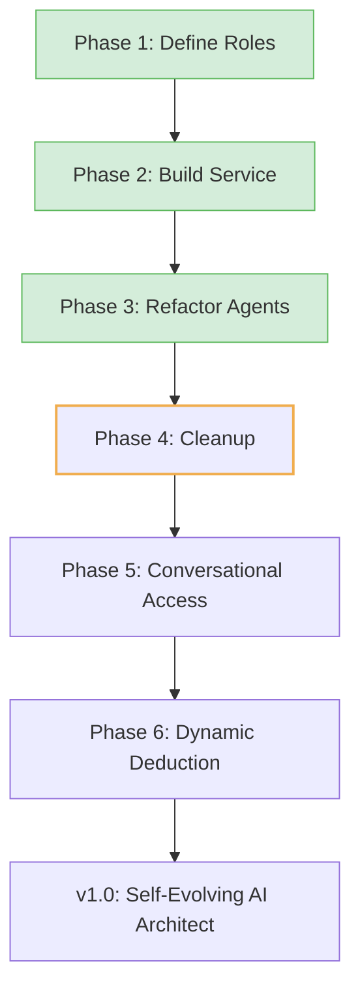

# The CORE Project Roadmap

## For New Users: Where CORE Is Going

CORE is evolving from a prototype that watches code (**A0**) to a conversational AI architect (**A4**) that builds apps from your ideas — no coding needed.
Each phase moves us toward accessible, self-evolving software development, governed by strict rules.

👉 **You can help!** Check out the **Next Up** phase in the table below for great contribution opportunities.
💡 **Try It:** Check open issues to contribute to a phase.

---

## Preamble: From Foundation to Self-Evolution

* **CORE v0.2.0** established a stable foundation: audits, governance, and a constitution (`.intent/`).
* The core logic for a policy-driven AI layer (**Mind/Body/Will**) is now implemented.
* Next steps focus on expanding the system's intelligence by improving its conversational abilities and capacity for dynamic, optimized reasoning.

📄 **Historical work:** [`docs/archive/StrategicPlan.md`](docs/archive/StrategicPlan.md)

---

## GitHub Epic: Policy-Driven Cognitive Layer

### The v1.0 Epic: Mind/Body/Will Trinity

**Goal:** Build a self-evolving system that understands non-coders’ ideas and optimizes AI usage without hardcoded limits.

---

## Roadmap Phases

| Phase                    | Challenge                    | Goal                                                           | Status      | Opportunity                                                        | ETA               |
| ------------------------ | ---------------------------- | -------------------------------------------------------------- | ----------- | ------------------------------------------------------------------ | ----------------- |
| 1: Constitution          | Implicit AI roles in code    | Define `cognitive_roles.yaml` for roles like Planner, Coder    | ✅ Completed | Refine roles or propose new specialized agents (e.g., TestWriter). | Completed Q3 2024 |
| 2: Machinery             | Body has AI logic            | Build simple `CognitiveService` to read roles                  | ✅ Completed | Optimize the CognitiveService for performance or caching.          | Completed Q3 2024 |
| 3: Agents                | Agents use hardcoded clients | Refactor agents to use `CognitiveService`                      | ✅ Completed | Improve the agent reasoning loop in `run_development_cycle`.       | Completed Q3 2024 |
| 4: Cleanup               | Obsolete classes             | Remove old `BaseLLMClient`; update `runtime_requirements.yaml` | ▶️ Next Up  | Remove `src/core/clients.py` and update any remaining imports.     | Q4 2024           |
| 5: Conversational Access | CLI limits non-coders        | Add `IntentTranslator` role to parse informal input            | ⏳ Planned   | Propose role; build `core-admin` chat CLI.                         | Q1 2025           |
| 6: Dynamic Deduction     | Static LLM assignments       | Add `DeductionAgent` + policy to optimize LLM choices          | ⏳ Planned   | Propose `deduction_policy.yaml`; code scoring logic.               | Q1 2025           |

---

## Visual (Mermaid)

---

## Future Phases (Post-v1.0)

| Phase              | Goal                                                   | ETA     |
| ------------------ | ------------------------------------------------------ | ------- |
| Web Interface & DB | Evolve CLI to web UI with DB backing for accessibility | Q2 2025 |

---

## Historical Roadmap (v0.2.0, Completed)

* ✅ Scaling Constitution
* ✅ Autonomous MVP
* ✅ Self-Improvement
* ✅ Robustness
* ✅ Architectural Health

---

## Troubleshooting

* **Confused?** Start with *Worked Example* to see CORE in action.
* **Want to contribute?** Open a GitHub issue for a phase task (e.g., *“Refactor to remove src/core/clients.py”*).
* **Audit fails?** Check `reports/drift_report.json` after running `make check`.

---

## Takeaways

* **v1.0 targets Q1 2025**, with conversational access and dynamic deduction.
* The foundational work is complete; focus is now on intelligence and usability.
* **Next:** See `CONTRIBUTING.md` to join **Phase 4**.

---

## Contribute

The immediate focus is **Phase 4: Cleanup**. This is a great opportunity for a first contribution!
✅ Check the open GitHub issues for a task related to removing the old client code.
