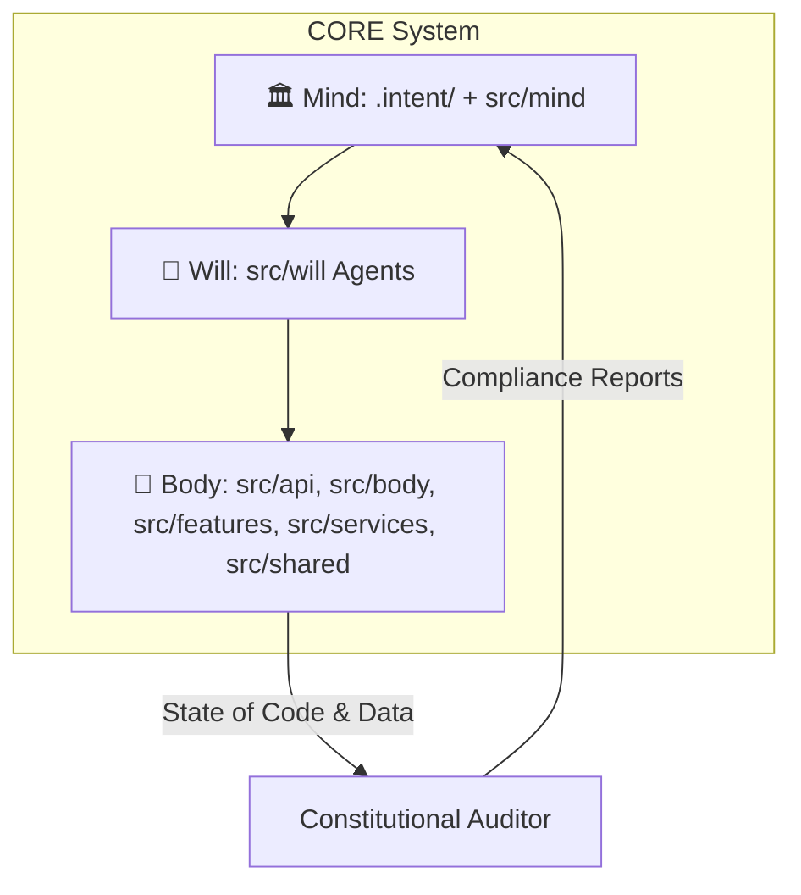

# CORE Architecture

## 1. Quick Start for New Readers

At its heart, CORE solves one persistent problem in software engineering:

> **How do you keep intent and implementation aligned as a system evolves?**

CORE does this by enforcing a strict, governed separation between:

* **Rules (the Mind)** — what the system must be.
* **Code (the Body)** — what the system does.
* **Agents (the Will)** — how AI reasons and proposes changes.

A dedicated governance layer continuously checks that the Body obeys the Mind, and that the Will never escapes its constraints.

If you want to *see* this in action, start with the
📘 **[Worked Example](07-worked-example.md)**, where a generated application violates an architectural rule and the Constitutional Auditor catches it.

---

## 2. The Mind–Body–Will Architecture

CORE’s architecture is built around three cooperating layers.

### 🏛️ The Mind — Intent & Governance

* **What it is:** The *constitution* of the system.
* **Where it lives:**

  * Configuration & policies: `.intent/`
  * Enforcement logic: `src/mind/`

The Mind defines:

* principles and policies (what must always be true),
* architectural and domain constraints,
* knowledge about the codebase,
* rules for changing the rules (governance protocols).

The Mind is the **ultimate source of truth** for what CORE is allowed to be.

---

### 🦾 The Body — Execution & Mechanics

* **What it is:** The machinery that does work.
* **Where it lives:**

  * `src/api/` — HTTP API surface
  * `src/body/` — CLI, actions, services
  * `src/features/` — feature domains (introspection, self-healing, autonomy, …)
  * `src/services/` — infrastructure (DB, LLMs, context, validation, storage)
  * `src/shared/` — shared models, utilities, config

The Body:

* runs audits and tests,
* edits and validates files,
* manages databases and vector stores,
* orchestrates workflows via the `core-admin` CLI.

The Body **acts**, but does not reason.

---

### 🧠 The Will — Agents & Reasoning

* **What it is:** The reasoning layer and AI agents.
* **Where it lives:** `src/will/`

The Will:

* reads constitutional rules and project context,
* plans changes (Planner, Micro-Planner),
* writes or modifies code and tests (Coder Agent),
* helps with analysis and review (Reviewer / Deduction agents),
* runs under orchestration (`cognitive_service`, `prompt_pipeline`, `validation_pipeline`).

The Will **must obey** the Mind and can only act through the Body.

---

### Mind–Body–Will in One Picture



The **Constitutional Auditor** is part of the Mind’s enforcement logic and continuously checks whether the Body still obeys the rules encoded in `.intent/`.

---

## 3. Anatomy of the Mind (`.intent/` + `src/mind/`)

### 3.1. The `.intent/` Directory

The `.intent/` directory encodes the *static* Mind — the rules, policies, and knowledge that define the governed system.

Typical structure:

| Directory       | Purpose                                | Example Files               |
| --------------- | -------------------------------------- | --------------------------- |
| `mission/`      | Project goals & principles             | `principles.yaml`           |
| `policies/`     | Enforceable rules for code & agents    | `code_standards.yaml`       |
| `knowledge/`    | System’s understanding of its own code | `knowledge_graph.json`      |
| `constitution/` | Rules for changing the rules           | `approvers.yaml`            |
| `proposals/`    | Draft constitutional amendments        | `cr-*.yaml`                 |
| `config/`       | Runtime & environment requirements     | `runtime_requirements.yaml` |
| `schemas/`      | Schemas validating Mind files          | `*.schema.json`             |
| `charter/`      | Higher-level governance contracts      | `policies/*.yaml`           |

The Mind is designed for **safety**, **traceability**, and **governed evolution**.

---

### 3.2. Governance Engine (`src/mind/`)

While `.intent/` defines the rules, `src/mind/` implements the **governance logic** that enforces them.

Key components include:

* `src/mind/governance/audit_context.py` — builds the context for audits.
* `src/mind/governance/auditor.py` — orchestrates checks.
* `src/mind/governance/checks/` — individual checks (coverage, IDs, imports, knowledge, security, etc.).
* `src/mind/governance/policy_loader.py` and `policy_resolver.py` — load and interpret policies from `.intent/`.
* `src/mind/governance/runtime_validator.py` — runtime validation logic.

Together, these components implement the **Constitutional Auditor**.

**Core idea:** the Mind is not just configuration — it is an active subsystem that can veto unsafe or non-compliant changes.

---

## 4. Anatomy of the Body (`src/api`, `src/body`, `src/features`, `src/services`, `src/shared`)

The Body contains all operational mechanics.
Its structure is reflected directly in the repository layout.

### 4.1. `src/api/` — External API Surface

* FastAPI application (`api/main.py`).
* HTTP routes under `api/v1/`:

  * development & knowledge routes, etc.
* Bridges external callers into governed workflows.

### 4.2. `src/body/` — CLI, Actions & Core Services

* `src/body/cli/` — the **`core-admin`** CLI:

  * `commands/` — Typer command groups (check, coverage, develop, fix, inspect, manage, run, search, secrets, submit, …).
  * `logic/` — shared CLI orchestration logic (agents, audits, build, byor, diagnostics, sync, status, tools, etc.).
* `src/body/actions/` — low-level actions (file edits, governance actions, validation actions).
* `src/body/services/` — services for:

  * capability management,
  * crate creation & processing,
  * LLM client orchestration,
  * service registry and validation policies.

This is where **most operational workflows** are wired together.

### 4.3. `src/features/` — Higher-Level Capabilities

Feature domains built on top of Body + Mind + Will:

* `features/introspection/` — symbol discovery, knowledge graph building, drift detection, vectorization.
* `features/self_healing/` — coverage analyzers, test generators, remediation services, header/docstring/ID fixes.
* `features/autonomy/` — autonomous developer pipeline, micro-proposal executor.
* `features/project_lifecycle/` — project bootstrap, definition, integration, scaffolding.
* `features/maintenance/` — migration services, .env sync, command sync.
* `features/demo/` — small demo flows (e.g., hello_world).

These are **use-cases** and **capabilities**, not generic utilities.

### 4.4. `src/services/` — Infrastructure & Integration

Shared infrastructure services:

* `services/database/` — models, session manager, migration helpers.
* `services/llm/` — LLM client abstractions, registry, providers (OpenAI, Ollama, …).
* `services/context/` — context building, caching, validation, redaction.
* `services/storage/` — file classification & handling.
* `services/validation/` — Black formatter, Ruff linter, syntax checker, pytest runner, YAML validator.
* `services/knowledge/` — knowledge service entrypoints (where present).

These provide everything the Body and Will need to interact with the outside world.

### 4.5. `src/shared/` — Shared Models, Utilities & Config

Cross-cutting primitives used by the entire system:

* `shared/models/` — audit, capability, drift, execution models.
* `shared/utils/` — parsing, header tools, embedding utilities, subprocess helpers, YAML processing.
* `shared/config.py` and `config_loader.py` — configuration system.
* `shared/logger.py`, `action_logger.py` — logging.
* `shared/ast_utility.py` — AST helpers for introspection.

`src/shared/` must remain **dependency-light and stable**, as many subsystems rely on it.

### 4.6. `src/main.py` — Process Entry Point

A light-weight root entry script that wires up the top-level application when the project is executed as a program.

---

## 5. Anatomy of the Will (`src/will/`)

The Will is where CORE’s agents live.

Key directories:

* `will/agents/` — Planner, Coder, Micro-Planner, Execution, Tagger, Self-Correction, etc.
* `will/orchestration/` —

  * `cognitive_service.py` — central access point for agents.
  * `intent_alignment.py`, `intent_guard.py` — keep agent activity aligned with intent.
  * `prompt_pipeline.py` — builds prompts from context and policies.
  * `validation_pipeline.py` — validates agent outputs before they reach the Body.
* `will/cli_logic/` — interactive and proposal-oriented CLI flows (chat, micro-proposals, reviewer tools).

The Will is **not allowed** to bypass the Mind or act directly on the filesystem.
It must go through:

1. Context builders (Body + services),
2. Governance constraints (Mind),
3. Validation pipelines (Body),
4. Then finally write operations (Body actions).

---

## 6. Example Lifecycles

### 6.1. Developer-Driven Change (Standard Loop)

1. **Write code in `src/`** (Body).
2. **Fix IDs & metadata**:

   ```bash
   poetry run core-admin fix ids --write
   ```
3. **Sync knowledge** (update Mind’s understanding):

   ```bash
   poetry run core-admin manage database sync-knowledge
   ```
4. **Run constitutional audit**:

   ```bash
   poetry run core-admin check audit
   ```
5. **Commit & push** only if the audit passes.

This keeps implementation aligned with intent.

---

### 6.2. Autonomous Feature Development (Governed)

1. **Describe the goal**:

   ```bash
   poetry run core-admin develop feature "Add health endpoint"
   ```
2. The **Will** (agents) generate or modify code & tests inside a crate.
3. The **Body** runs validation (Black, Ruff, tests).
4. The **Mind** runs constitutional audits over the proposed changes.
5. The crate is **accepted or rejected** based on all checks.

No uncontrolled changes are allowed.

---

## 7. Why This Architecture Works

CORE’s architecture ensures that:

* **Intent and implementation remain aligned** — the Mind encodes rules, the Body is continuously checked.
* **Reasoning is governed** — agents act only under the Mind’s constraints.
* **Knowledge is explicit** — the system maintains a knowledge graph and symbols describing itself.
* **Evolution is safe** — every change is validated and auditable.

The separation of **Mind**, **Body**, and **Will** is the central safety mechanism.

---

## 8. Next Steps

Continue with:

* **[Governance Model](03_GOVERNANCE.md)** — how changes are proposed, validated, and approved.
* **[Philosophy](01_PHILOSOPHY.md)** — why CORE operates according to constitutional principles.
* **[Developer Cheat Sheet](../developer-guide/02-cheatsheet.md)** — all atomic concepts and references in one place.
