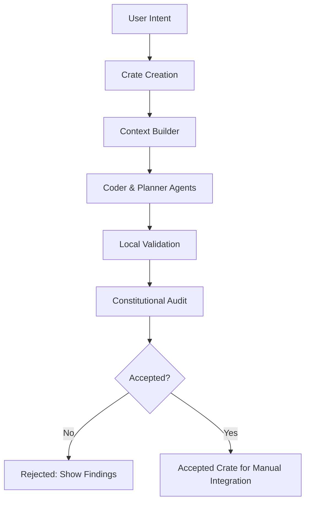

# Worked Example — Autonomous Development in CORE

This document provides a **realistic, accurate, present-day walkthrough** of how CORE takes a human intent and turns it into a governed, validated crate using the Mind–Body–Will architecture.

Everything here reflects the **actual state of the codebase** (as of 2025).
No speculative features, no unimplemented commands, no daemon.

---

## 🎯 Scenario

A developer wants to add a **simple health endpoint** to the project.

They run:

```bash
poetry run core-admin develop feature "Add health endpoint"
```

CORE now begins a fully governed autonomous workflow.

Let’s walk through it step-by-step.

---

# 1. Intent Capture (Body → Will)

The CLI command lands in:

* `src/body/cli/commands/develop.py`
* which routes into the orchestration logic under `src/will/cli_logic/run.py`

CORE now:

1. Reads the user intent.
2. Packages it into a high-level job request.
3. Hands it to the **Autonomous Developer** pipeline:

   * `src/features/autonomy/autonomous_developer.py`

**Output:** a new crate folder under `.core/crates/…` containing metadata for the requested feature.

---

# 2. Crate Creation (Body)

Crate creation is handled by:

* `src/body/services/crate_creation_service.py`

Inside the crate, CORE records:

* the natural-language goal,
* target files or code areas (if detectable),
* project context snapshot,
* initial metadata (IDs, capabilities).

**Everything generated stays inside this crate**, never touching `src/` directly.

---

# 3. Context Building (Body)

Next, CORE builds a **governed context** for the agents.

Context is assembled by:

* `src/services/context/builder.py`
* with providers from `src/services/context/providers/*`

The context may include:

* relevant source files,
* existing route definitions,
* related capabilities,
* system rules from `.intent/`,
* Knowledge Graph references,
* symbols associated with web/API behavior.

**Important:**
Agents never receive the entire project — only the curated, governance-aligned context.

---

# 4. Autonomous Coding (Will)

The **Coder Agent** generates the proposed feature.

Agents involved:

* `src/will/agents/coder_agent.py`
* `src/will/agents/planner_agent.py`
* `src/will/orchestration/prompt_pipeline.py`
* `src/will/orchestration/validation_pipeline.py`

The agent writes:

* route file additions,
* handler function,
* optional tests,
* optional documentation.

All outputs go into the **crate**, not the real project.

---

# 5. Local Validation (Body)

Before anything moves forward, CORE validates the generated code.

Validation tools:

* `src/services/validation/black_formatter.py`
* `src/services/validation/ruff_linter.py`
* `src/services/validation/syntax_checker.py`
* `src/services/validation/test_runner.py`

Checks include:

* Formatting
* Linting
* Syntax
* Test execution

If validation fails:

* The crate is **rejected**.
* The developer sees detailed validation errors.

---

# 6. Constitutional Audit (Mind)

If validation passes, the **Mind** audits the proposed changes.

Audit components:

* `src/mind/governance/audit_context.py`
* `src/mind/governance/auditor.py`
* `src/mind/governance/checks/*`

Checks include:

* Import rules
* ID & capability hygiene
* Security rules
* Domain boundaries
* Coverage expectations
* Knowledge drift
* Manifest structure

If any violation is found:

* The crate is **rejected**, even if tests pass.
* The developer receives a constitutional reasoning trace.

This guarantees safety.

---

# 7. Outcome — Accepted or Rejected

After validation + audit:

### **If accepted:**

CORE marks the crate as `ACCEPTED` and instructs the developer to integrate the changes manually.

### **If rejected:**

CORE provides:

* a clear list of violations,
* instructions to fix them,
* or opportunities for the user to adjust their request.

---

# 8. Manual Integration (Developer Step)

CORE does **not** directly write into the source tree.

Instead:

1. The developer inspects the crate.
2. Copies/merges the changes into `src/`.
3. Runs local audits:

   ```bash
   poetry run core-admin check audit
   ```
4. Commits only after passing.

This enforces human governance over final integration.

---

# 9. Summary of the Lifecycle



---

# 10. What This Example Demonstrates

This walkthrough shows the **true state of autonomy** in CORE today:

* ✔ Governed generation (A1)
* ✔ Strong constitutional enforcement
* ✔ Knowledge-driven reasoning
* ✔ Full validation before audit
* ✔ Human control over integration
* ✖ No background daemon
* ✖ No direct write to repo from agents
* ✖ No speculative features

CORE’s autonomy is already powerful — but always constrained by governance.

---

# 11. Next Steps

To understand deeper parts of the system, continue with:

* [Architecture](02_ARCHITECTURE.md)
* [Governance](03_GOVERNANCE.md)
* [Autonomy Ladder](05-autonomy-ladder.md)
* [Context & Comparisons](06-context-and-comparisons.md)

This example represents the minimum guaranteed contract of CORE’s autonomous capabilities. Everything future-facing builds on this foundation.
