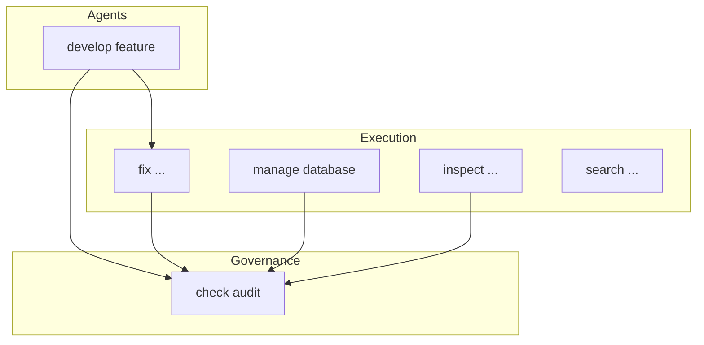

# CORE CLI Commands Table

This document provides a **clean, accurate, up-to-date** command table for the `core-admin` CLI.
It reflects:

* all commands that **actually exist** in your current CLI tree,
* grouped logically,
* with short, actionable descriptions,
* PLUS a separate section for **Planned / Experimental** commands that appear in design docs but do *not* exist in this version.

This avoids ambiguity and keeps developers aligned with reality.

---

# ✅ 1. Real Commands (Implemented in `src/body/cli/commands/`)

These commands are **shipped** and available today.

## 1.1. `check` — Validation & Governance

| Command          | Description                                                                                  |
| ---------------- | -------------------------------------------------------------------------------------------- |
| `check audit`    | Run the full Constitutional Audit (Mind checks).                                             |
| `check status`   | Show project health summary.                                                                 |
| `check validate` | Run validation pipeline (formatting, linting, syntax, tests) *(if present in your version)*. |

---

## 1.2. `develop` — Autonomous Crate Generation

| Command               | Description                                           |
| --------------------- | ----------------------------------------------------- |
| `develop feature "…"` | Generate a crate for a new feature using governed AI. |

---

## 1.3. `fix` — Automated Self-Healing

| Command                         | Description                          |
| ------------------------------- | ------------------------------------ |
| `fix ids --write`               | Fix or assign `# ID:` tags.          |
| `fix code-style --write`        | Run Black + Ruff formatting/linting. |
| `fix docstrings --write`        | Generate or correct docstrings.      |
| `fix headers --write`           | Ensure file headers match standards. |
| `fix purge-legacy-tags --write` | Remove outdated capability tags.     |
| `fix all --write`               | Apply all safe remediations.         |
| `fix all --dry-run`             | Show what would be changed.          |

(Commands are backed by services under `src/features/self_healing/`.)

---

## 1.4. `inspect` — Introspection & Diagnostics

| Command                | Description                                                                               |
| ---------------------- | ----------------------------------------------------------------------------------------- |
| `inspect command-tree` | Display the full CLI command tree.                                                        |
| `inspect project`      | Show structural info (domains, capabilities, drift, etc.) *(if present in your version)*. |

---

## 1.5. `manage` — Knowledge, Database, Proposals

| Command                          | Description                                     |
| -------------------------------- | ----------------------------------------------- |
| `manage database sync-knowledge` | Rebuild Knowledge Graph, symbols, capabilities. |
| `manage proposals new "…"`       | Create a new constitutional proposal.           |

---

## 1.6. `mind` — Governance Utilities

| Command              | Description                                         |
| -------------------- | --------------------------------------------------- |
| `mind show-policies` | List loaded governance policies *(if implemented)*. |
| `mind show-domains`  | Inspect domain boundaries *(if implemented)*.       |

---

## 1.7. `run` — Execution Utilities

| Command                  | Description                                   |
| ------------------------ | --------------------------------------------- |
| `run process-crate <id>` | Process a specific crate *(only if present)*. |

---

## 1.8. `search` — Search Symbols & Capabilities

| Command                 | Description                                  |
| ----------------------- | -------------------------------------------- |
| `search symbol "…"`     | Search for symbol names via Knowledge Graph. |
| `search capability "…"` | Search for capabilities.                     |

---

## 1.9. `secrets` — Local Secrets Management

| Command            | Description                         |
| ------------------ | ----------------------------------- |
| `secrets init`     | Initialize developer secrets store. |
| `secrets set NAME` | Set a secret key locally.           |

---

# 📦 2. Additional Commands (Exist in Tree but Vary by Version)

These commands appear in your directory tree, but their exact availability depends on how your CLI wiring is configured.

| Command                  | Description                                                 |
| ------------------------ | ----------------------------------------------------------- |
| `enrich symbols`         | Enrich symbol metadata *(if wired)*.                        |
| `enrich capabilities`    | Recompute capability metadata *(if wired)*.                 |
| `submit proposal <path>` | Submit a governance proposal *(depending on your version)*. |
| `submit crate <id>`      | Submit crate metadata *(rarely used in 2025 design)*.       |

These are **real modules**, but may not be registered in your installed CLI.

---

# ⚠️ 3. Planned / Experimental (Not Available in This Version)

These commands appear in old docs, design notes, or roadmap discussions, *but are not implemented today*.
They are included here to prevent confusion.

| Command (Not Implemented)  | Why It’s Listed                                                     |
| -------------------------- | ------------------------------------------------------------------- |
| `coverage check`           | Planned advanced coverage tooling (self-healing integration).       |
| `coverage remediate`       | Planned coverage-aware remediation pipeline.                        |
| `manage proposals approve` | Advanced governance workflow (A4+).                                 |
| `submit changes`           | Deprecated early idea (no longer part of A1–A3 roadmap).            |
| `daemon start`             | Historical design reference — **no daemon exists in current CORE**. |
| `daemon stop`              | Same — deprecated concept, removed.                                 |
| `develop refactor`         | Planned future A3 governed refactoring command.                     |
| `develop test`             | Planned test-first generation (superseded by A2 agent planner).     |

These entries help orient contributors without implying they are available.

---

# 🧭 4. Command Map (Mind → Body → Will)

This diagram shows:

* Will (agents) trigger Body (validation) and Mind (audit).
* Body commands often run Mind checks.
* Mind never calls Will directly.

---

# 🧩 5. Summary

* **Section 1**: Commands that *definitely exist* in the current CORE installation.
* **Section 2**: Commands that exist in the repo but may not be CLI-registered.
* **Section 3**: Planned/experimental commands — *not implemented* but appear in design materials.

This structure ensures developers have:

* clarity,
* correctness,
* traceability,
* and no ambiguity between **real**, **maybe**, and **not implemented**.

If the CLI changes, update this document immediately — the CLI is the authoritative gateway to CORE’s governed autonomy.
