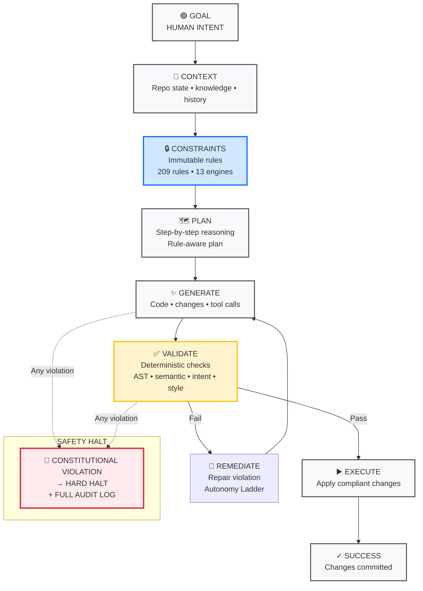
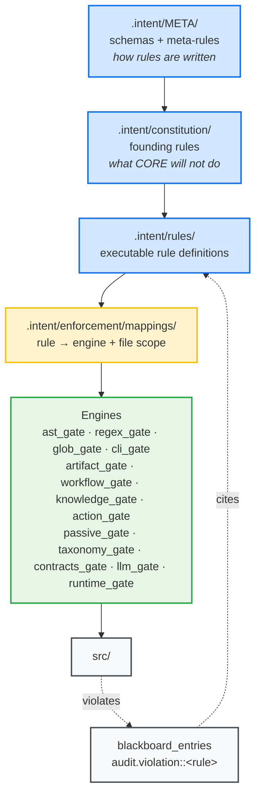
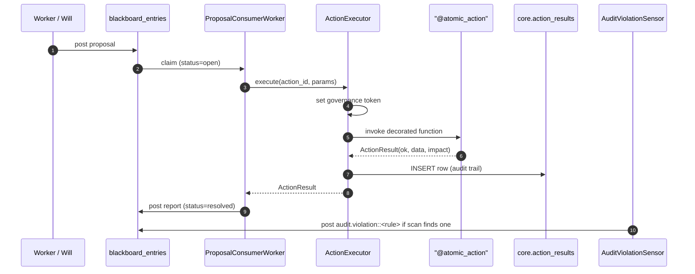

# How CORE Works

CORE is built on a single architectural principle: **governance must be structural, not advisory**.

Rules are not suggestions checked after the fact. They are enforcement gates that determine whether execution proceeds at all.

---

## The Constitutional Loop

Every autonomous operation in CORE follows the same governed loop:



---

## Four Repository Layers

CORE separates responsibility across four layers. Three are enforced as constitutional law. One is the human reasoning layer.

### 📐 Specs — Human Intent

**Location:** `.specs/`

The human intent layer. Contains architectural papers, northstar documents, user requirements, architectural decision records, and planning documents. This is where the reasoning behind constitutional decisions lives.

`.specs/` is authored by humans and never written by CORE. It is vectorized into the `core_specs` collection and semantically searchable — context build evidence draws from it alongside constitutional rules.

Start here: [`.specs/northstar/CORE-What-It-Does.md`](https://github.com/DariuszNewecki/CORE/blob/main/.specs/northstar/CORE%20-%20What%20It%20Does.md)

---

### 🧠 Mind — Law

**Location:** `.intent/` + `src/mind/`

Mind defines what is allowed, required, or forbidden. It contains machine-readable constitutional rules, enforcement mappings, phase-aware enforcement models, and the authority hierarchy:

```
Meta → Constitution → Policy → Code
```

In `.intent/` this expands to a chain that ends at the engines which actually read `src/`:



Every executable rule has a mapping; every mapping names exactly one engine; every engine reads files only — never the other way around. Violations land on the blackboard as `audit.violation::<rule>` and cite back at the rule that produced them, which is how the [Proof Index](proof-index.md) audit-state query observes them.

**Mind never executes. Mind never mutates. Mind defines law.**

The `.intent/` directory is the authoritative source for operational governance. It is human-authored and immutable at runtime. CORE cannot write to it. No autonomous operation can amend constitutional law.

---

### ⚖️ Will — Judgment

**Location:** `src/will/`

Will reads constitutional constraints, orchestrates autonomous reasoning, and records every decision with a traceable audit trail. Every operation follows a structured phase pipeline:

```
INTERPRET → PLAN → GENERATE → VALIDATE → STYLE CHECK → EXECUTE
```

**Will never bypasses Body. Will never rewrites Mind.**

---

### 🏗️ Body — Execution

**Location:** `src/body/`

Body contains deterministic, atomic components: analyzers, evaluators, file operations, git services, test runners, CLI commands.

**Body performs mutations. Body does not judge. Body does not govern.**

---

## How an Action Executes

Every mutation in CORE flows through one path. Workers do not call each other; they post to the blackboard. `ProposalConsumerWorker` claims approved proposals and dispatches them through `ActionExecutor`, which is the only caller permitted to invoke an `@atomic_action`. The decorator refuses any other caller — a direct call raises `GovernanceBypassError`.



Two things this diagram makes structural:

- **No bypass.** The governance token is set inside `ActionExecutor.execute` and read by the `@atomic_action` decorator. A direct call (step 5 without step 3) finds no token and refuses. This is the mechanism behind row 2 of the [Proof Index](proof-index.md).
- **No untracked mutation.** Every successful step 5 produces a step 7 — a row in `core.action_results` with `agent_id = 'ActionExecutor'`. The audit trail is the record of what ran, not a summary of what was attempted. This is row 4 of the [Proof Index](proof-index.md).

---

## Constitutional Primitives

CORE's governance model is built on four primitives only:

| Primitive | Purpose |
|-----------|---------|
| Document | Persisted, validated artifact |
| Rule | Atomic normative statement |
| Phase | When the rule is evaluated |
| Authority | Who may define or amend it |

Rules carry one of three enforcement strengths: **Blocking** · **Reporting** · **Advisory**

A Blocking rule that fails halts execution immediately. No partial states. No exceptions.

---

## Enforcement Engines

CORE evaluates rules through thirteen engines:

| Engine | Method |
|--------|--------|
| `ast_gate` | Deterministic structural analysis (AST-based) |
| `regex_gate` | Pattern-based text enforcement |
| `glob_gate` | Path and boundary enforcement |
| `cli_gate` | CLI surface and command-shape enforcement |
| `artifact_gate` | Declared-vs-discovered artifact completeness |
| `workflow_gate` | Phase-sequencing and coverage checks |
| `knowledge_gate` | Responsibility and ownership validation |
| `action_gate` | Atomic-action invariants |
| `passive_gate` | Substrate-enforced rules (DB/runtime marker) |
| `taxonomy_gate` | Capability-id ↔ atomic-action coherence (ADR-079 D9) |
| `contracts_gate` | Cross-cutting data-contract coherence (context-level; ADR-102) |
| `llm_gate` | LLM-assisted semantic checks |
| `runtime_gate` | Runtime write authorization (`IntentGuard` per `CORE-Gate.md`) |

Deterministic when possible. LLM only when necessary.

---

## System Guarantees

Within CORE:

- No file outside an autonomy lane can be modified
- No structural rule can be bypassed silently
- No atomic action can execute outside the governed executor (inline authorization is deferred to the audit→consequence loop)
- Decisions are phase-aware and logged with decision traces (audit persistence is best-effort — surfaced as `AUDIT_GAP`, not silent; see the [Proof Index](proof-index.md))
- No agent can amend constitutional law

If a *blocking* rule fails, execution halts with no partial state. Reporting and advisory rules surface findings and continue — what blocks versus what reports depends on the mode.

---

## Trust Model

| Component | Trusted? |
|-----------|---------|
| `.specs/` human intent | ✅ Yes |
| `.intent/` constitution | ✅ Yes |
| Rules engine | ✅ Yes |
| Audit system | ✅ Yes |
| Execution system | ✅ Yes |
| AI outputs | ❌ Never |
| Generated code | ❌ Never |
| Plans | ❌ Never |

The process is trustworthy even when the AI is not.
